# Release Process

This document describes exactly what happens when you ask to **bump the
version, build everything, and push a new release to GitHub**. It is the
step-by-step runbook for producing a tagged release of Cipherforge, from
editing the version strings to publishing the GitHub Release with binary
assets.

> **TL;DR** — edit the version in 3 files, add a changelog entry, build,
> zip the 8 binaries, commit, tag, push, then create the GitHub release with
> `gh`.

---

## Table of Contents

- [Release Flow at a Glance](#release-flow-at-a-glance)
- [Version Numbering](#version-numbering)
- [Step 1 — Update the Version Everywhere](#step-1--update-the-version-everywhere)
- [Step 2 — Update CHANGELOG.md](#step-2--update-changelogmd)
- [Step 3 — Build Everything](#step-3--build-everything)
- [Step 4 — Package the Release Assets](#step-4--package-the-release-assets)
- [Step 5 — Commit and Tag](#step-5--commit-and-tag)
- [Step 6 — Push to GitHub](#step-6--push-to-github)
- [Step 7 — Create the GitHub Release](#step-7--create-the-github-release)
- [Step 8 — Verify the Release](#step-8--verify-the-release)
- [Release Checklist](#release-checklist)

---

## Release Flow at a Glance

```mermaid
flowchart LR
    A[Decide version] --> B[Update version strings]
    B --> C[Update CHANGELOG.md]
    C --> D[Run build-all]
    D --> E[Zip 8 binaries + checksums]
    E --> F[Commit & tag vX.Y.Z]
    F --> G[git push + push tags]
    G --> H[gh release create]
    H --> I[Verify download & version]
```



A full release touches only these areas:

| Area | Files |
|---|---|
| Version strings | `cmd/cfo/main.go`, `build-all.ps1`, `build-all.sh` |
| Changelog | `CHANGELOG.md` |
| Build | `build-all.ps1` / `build-all.sh` → `dist/` |
| Git | commit on `main`, annotated tag `vX.Y.Z` |
| GitHub | `gh release create` with the 8 zips + `checksums.txt` |

---

## Version Numbering

Cipherforge follows **semantic versioning** (`major.minor.patch`):

- **Major** — breaking change (e.g. v5.0.0 dropped v4 backward compatibility,
  changing the `.cfo` file format).
- **Minor** — new feature, fully backward compatible (e.g. v5.1.0 added
  scrollable results and paging).
- **Patch** — bug fix or polish with no new behavior (e.g. v5.0.5 made atomic
  writes the default).

Find the current version before bumping:

```bash
git tag --sort=-v:refname | head -1     # latest tag, e.g. v7.0.1
cfo -v                                   # version baked into the built binary
```

The version string in the repo currently defaults to `7.0.1` — the latest
tagged release. A bump picks the next number per the rules above.

---

## Step 1 — Update the Version Everywhere

The version lives in **three** places that must all be updated, plus the
changelog and (optionally) example strings in the docs.

### 1a. `cmd/cfo/main.go`

`var Version` is the source of truth baked into every binary at link time:

```go
// cmd/cfo/main.go
var Version = "7.0.1"     // ← change this
var GitCommit = "none"    // (do not edit — stamped at build time)
```

When the binary runs, `init()` writes this into the armor header as
`Version: Cipherforge 7.0.1`, so this value also controls the `Version:`
line emitted by `-b`/`--base64` armored output.

### 1b. `build-all.ps1` (Windows build default)

Two spots reference the default version — the fallback value and the help
text:

```powershell
# build-all.ps1
[string]$Version = $env:VERSION   # (unchanged — env override support)

if (-not $Version) {
    $Version = '7.0.1'            # ← change this
}
```

```powershell
Write-Host '  -Version    Overrides the version string (default: 7.0.1).'  # ← update
```

### 1c. `build-all.sh` (Unix build default)

```bash
# build-all.sh
VERSION="${VERSION:-7.0.1}"       # ← change this
```

### 1d. Docs and examples (optional, but keep consistent)

- `README.MD` — the "Building from Source" examples hard-code a version in the
  `-ldflags` snippet (`-X main.Version=7.0.1`). Update if the example version
  is meant to track the current release.
- `ARCHITECTURE.MD` — the "Build System" section shows `-X main.Version=...`
  in a linker-flag example. Same deal.

> The build scripts accept an explicit override (`-Version` / `-VERSION` env),
> so even if the defaults lag behind, an explicit value always wins. Keeping
> all three in sync is what makes `build-all` produce correctly-stamped
> binaries with **no** extra flags.

---

## Step 2 — Update CHANGELOG.md

Add a new entry at the **top** of `CHANGELOG.md`, above the previous release.
The format is `## vX.Y.Z (YYYY-MM-DD)` with `### Added` / `### Changed` /
`### Fixed` / `### Removed` / `### Documentation` subsections:

```markdown
## v5.2.0 (2026-08-23)

### Added

- **Describe the new feature here.** One sentence, bold lead-in, period at the
  end.

### Changed

- **Describe a behavior change here.** Explain the user-visible effect.

### Fixed

- **Describe a bug fix here.** Note what was broken and how it behaves now.
```

Style rules observed in existing entries:

- Each bullet starts with a **bold** summary phrase followed by a period.
- Use `**` emphasis for the feature name, then a plain description.
- Keep entries user-visible; internal refactors still deserve a line.
- Date uses `YYYY-MM-DD`.

---

## Step 3 — Build Everything

### Prerequisites

| Tool | Required? | Notes |
|---|---|---|
| Go 1.25+ | Yes | `go version` to check |
| `git` | Recommended | commit stamp + `git archive` source tarball; skipped gracefully if absent |
| `upx` | Optional | used to compress copies into `dist/compressed/`; skipped if absent |
| Network | Only for first `--vendor` run | subsequent builds are offline from `vendor/` |

### Run the build

On **Windows (PowerShell)**:

```powershell
pwsh -File .\build-all.ps1
```

To snapshot dependencies into `vendor/` first (needs network once):

```powershell
pwsh -File .\build-all.ps1 -Vendor
```

On **Unix (bash)**:

```bash
./build-all.sh
./build-all.sh --vendor     # once, with network
```

The version defaults come from Step 1. To override without touching files:

```powershell
pwsh -File .\build-all.ps1 -Version 7.0.1
```

```bash
VERSION=7.0.1 ./build-all.sh
```

### What the build does

Both scripts run the same first two steps:

1. **Unit tests** — `go test ./...` (with `-race` only if requested and CGO is
   available). Any failure or `panic:` aborts the build.
2. **Cross-compiles 8 targets** in parallel, all `CGO_ENABLED=0` (fully
   static), `-trimpath`, `-buildvcs=false`:
   `linux/{amd64,arm64,386}`, `windows/{amd64,386}`, `darwin/{amd64,arm64}`,
   `freebsd/amd64`.

`build-all.sh` additionally:

3. Writes SHA256 sums of the binaries to `dist/checksums.txt`.
4. **UPX**-compresses copies into `dist/compressed/` (if `upx` present).
5. Writes a source archive `dist/cipherforge_source.tar.gz`.

> `build-all.ps1` stops after step 2. On Windows the release checksums are
> generated over the packaged zips in Step 4, which is what users download
> anyway.

### Inspect the output

```powershell
Get-ChildItem -Recurse dist\originals | Select-Object FullName, Length
Get-Content dist\checksums.txt
```

```bash
find dist -type f | sort
```

Output layout:

```
dist/
├── originals/                  # fully static, future-proof binaries
│   ├── linux/amd64/cfo
│   ├── linux/arm64/cfo
│   ├── linux/386/cfo
│   ├── windows/amd64/cfo.exe
│   ├── windows/386/cfo.exe
│   ├── darwin/amd64/cfo
│   ├── darwin/arm64/cfo
│   └── freebsd/amd64/cfo
├── compressed/                 # UPX copies (if upx available)
├── checksums.txt
└── cipherforge_source.tar.gz   # Unix builds only
```

Sanity-check the version stamp on one binary before releasing:

```powershell
.\dist\originals\windows\amd64\cfo.exe -v
```

```bash
./dist/originals/linux/amd64/cfo -v
```

---

## Step 4 — Package the Release Assets

GitHub release assets use the naming convention
`cfo_v<version>_<os>_<arch>.zip` — one zip per platform, plus a
`checksums.txt` over the zips. This is **different** from the raw
`dist/originals/...` layout, so the binaries must be zipped and renamed.

Set the version once:

```powershell
$v = "7.0.1"
```

```bash
v="7.0.1"
```

### Create the 8 platform zips

**PowerShell (Windows):**

```powershell
$out = "release-assets"; Remove-Item $out -Recurse -Force -ErrorAction SilentlyContinue
New-Item -ItemType Directory $out | Out-Null
$targets = @(
  @{ os='linux';   arch='amd64'; bin='cfo' },
  @{ os='linux';   arch='arm64'; bin='cfo' },
  @{ os='linux';   arch='386';   bin='cfo' },
  @{ os='windows'; arch='amd64'; bin='cfo.exe' },
  @{ os='windows'; arch='386';   bin='cfo.exe' },
  @{ os='darwin';  arch='amd64'; bin='cfo' },
  @{ os='darwin';  arch='arm64'; bin='cfo' },
  @{ os='freebsd'; arch='amd64'; bin='cfo' }
)
foreach ($t in $targets) {
  $src  = "dist\originals\$($t.os)\$($t.arch)\$($t.bin)"
  $name = "cfo_v${v}_$($t.os)_$($t.arch).zip"
  Compress-Archive -Path $src -DestinationPath "$out\$name"
}
```

**bash (Unix):**

```bash
out="release-assets"; rm -rf "$out"; mkdir -p "$out"
for p in linux/amd64 linux/arm64 linux/386 windows/amd64 windows/386 darwin/amd64 darwin/arm64 freebsd/amd64; do
  os="${p%%/*}"; arch="${p##*/}"
  bin="cfo"; [ "$os" = "windows" ] && bin="cfo.exe"
  (cd "dist/originals/$p" && zip -q -X "../../../$out/cfo_v${v}_${os}_${arch}.zip" "$bin")
done
```

### Generate the release `checksums.txt`

Checksums must cover the **zips** (that is what users download), not the raw
binaries.

**PowerShell:**

```powershell
Get-ChildItem "$out\*.zip" | Sort-Object Name | ForEach-Object {
  "{0}  {1}" -f (Get-FileHash $_.FullName -Algorithm SHA256).Hash.ToLower(), $_.Name
} | Set-Content "$out\checksums.txt"
```

**bash:**

```bash
( cd "$out" && sha256sum *.zip | sort -k2 > checksums.txt )
```

Final `release-assets/` contents to upload:

```
release-assets/
├── cfo_v7.0.1_linux_amd64.zip
├── cfo_v7.0.1_linux_arm64.zip
├── cfo_v7.0.1_linux_386.zip
├── cfo_v7.0.1_windows_amd64.zip
├── cfo_v7.0.1_windows_386.zip
├── cfo_v7.0.1_darwin_amd64.zip
├── cfo_v7.0.1_darwin_arm64.zip
├── cfo_v7.0.1_freebsd_amd64.zip
└── checksums.txt
```

> Optionally also upload the source archive produced by the Unix build
> (`dist/cipherforge_source.tar.gz`) as `source-v7.0.1.tar.gz`. Note that
> GitHub **automatically** attaches its own `Source code (zip)` and
> `Source code (tar.gz)` to every release, so this step is redundant — it is
> included only if you want a locally-built archive.

---

## Step 5 — Commit and Tag

Stage everything that changed — version strings, changelog, and the new
document if it isn't committed yet. Never commit `dist/`, `vendor/`, or
`cipherforge_releases/` (they are git-ignored).

```bash
git status                     # confirm only intended files changed
git add cmd/cfo/main.go build-all.ps1 build-all.sh CHANGELOG.md RELEASE.MD
git commit -m "Bump version to 7.0.1"
```

For a release that carries feature work, use a descriptive release commit:

```bash
git commit -m "Release v7.0.1: <short summary of what's new>"
```

Tag the release at the release commit. The repo uses a **version-only**
tag name (`v5.1.0`, not `v5.1.0-release`):

```bash
git tag -a v7.0.1 -m "Cipherforge v7.0.1"
```

Verify before pushing:

```bash
git log --oneline -3
git tag --points-at HEAD
git status
```

---

## Step 6 — Push to GitHub

Push the branch and all tags:

```bash
git push origin main
git push origin v7.0.1          # or: git push origin --tags
```

If a push is rejected because the remote moved, pull with rebase first and
re-tag if the commit hash changed:

```bash
git pull --rebase origin main
git tag -f v7.0.1
git push origin main --force-with-lease
git push origin v7.0.1 --force
```

> Prefer pushing the explicit tag over `--tags` when only one release tag is
> being published — it avoids accidentally publishing unrelated local tags.

---

## Step 7 — Create the GitHub Release

Use the `gh` CLI (available; the remote is
`https://github.com/vilshansen/cipherforge-go.git`).

From inside `release-assets/` so asset paths are short:

```bash
cd release-assets
gh release create v7.0.1 \
  cfo_v7.0.1_linux_amd64.zip \
  cfo_v7.0.1_linux_arm64.zip \
  cfo_v7.0.1_linux_386.zip \
  cfo_v7.0.1_windows_amd64.zip \
  cfo_v7.0.1_windows_386.zip \
  cfo_v7.0.1_darwin_amd64.zip \
  cfo_v7.0.1_darwin_arm64.zip \
  cfo_v7.0.1_freebsd_amd64.zip \
  checksums.txt \
  --title "Cipherforge v7.0.1" \
  --notes-file ../release-notes.md
```

Or attach assets after creating an empty release:

```bash
gh release create v7.0.1 --title "Cipherforge v7.0.1" --notes-file ../release-notes.md
gh release upload v7.0.1 cfo_v7.0.1_*.zip checksums.txt
```

### Release notes

Write `release-notes.md` summarizing the changes (condense the changelog
entry — no need to duplicate every bullet):

```markdown
## What's new in v7.0.1

- **Feature one** — one-line description.
- **Feature two** — one-line description.

### Fixes
- **Fix one** — one-line description.

**Checksums** (SHA256) are in `checksums.txt` attached to this release.
Source archives are auto-generated by GitHub below.
```

> GitHub automatically appends `Source code (zip)` and `Source code (tar.gz)`
> to every release — the `cipherforge_download.sh` script fetches those, so
> no action is needed.

---

## Step 8 — Verify the Release

1. **Binary version stamp** — download and run on the platforms you can test:

   ```bash
   curl -sSL -o cfo https://github.com/vilshansen/cipherforge-go/releases/download/v7.0.1/cfo_v7.0.1_linux_amd64.zip
   unzip -p cfo_v7.0.1_linux_amd64.zip cfo > cfo
   chmod +x cfo && ./cfo -v
   ```

2. **Checksums** — confirm the uploaded `checksums.txt` matches what you
   generated:

   ```bash
   curl -sSL https://github.com/vilshansen/cipherforge-go/releases/download/v7.0.1/checksums.txt
   ```

3. **Download script** — re-run the archive fetcher (optional; it pulls all
   releases into `cipherforge_releases/`):

   ```bash
   ./cipherforge_download.sh
   ```

4. **Smoke test** — encrypt/decrypt a file with the new binary:

   ```bash
   ./cfo -e sample.txt
   ./cfo -d sample.txt.cfo
   diff sample.txt decrypted.txt && echo "OK"
   ```

5. **GitHub page** — confirm the release exists with all 8 zips, the
   checksum file, and correct title/notes:

   ```bash
   gh release view v7.0.1
   ```

---

## Release Checklist

- [ ] Version bumped in **all three** places: `cmd/cfo/main.go`,
      `build-all.ps1`, `build-all.sh` (and doc examples if they track it).
- [ ] `CHANGELOG.md` entry added at the top with today's date.
- [ ] `./build-all.sh` (or `build-all.ps1`) passes: tests green, all 8
      targets compiled.
- [ ] `cfo -v` on a built binary prints the new version.
- [ ] 8 platform zips created with `cfo_v<ver>_<os>_<arch>.zip` naming.
- [ ] `checksums.txt` regenerated **over the zips**, not the raw binaries.
- [ ] Committed with a clear message; tagged `vX.Y.Z` at the release commit.
- [ ] Pushed `main` and the tag to `origin`.
- [ ] `gh release create` succeeded with all 8 zips + `checksums.txt`.
- [ ] Release notes written and attached.
- [ ] Verified: binary version, checksums, and an encrypt/decrypt round-trip.
```
